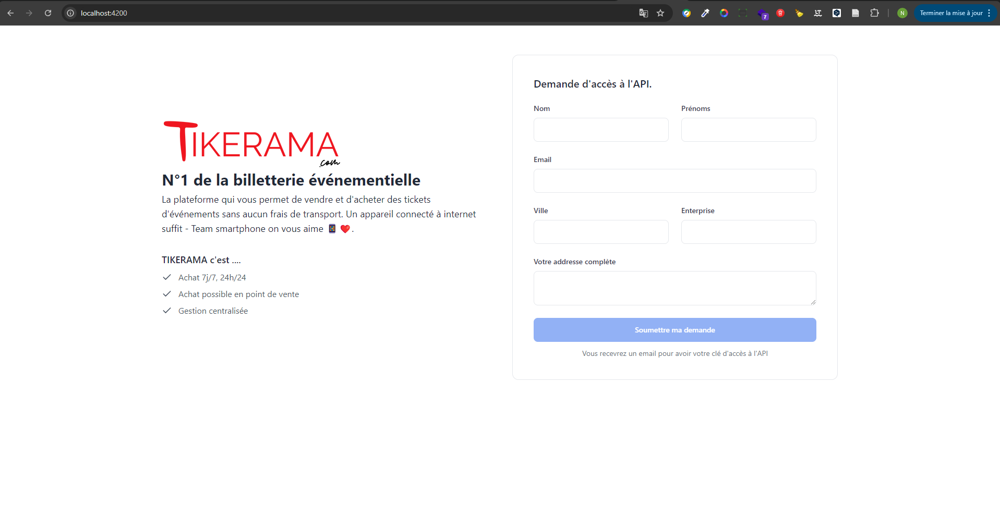

<p align="center"><a href="https://www.tikerama.com" target="_blank"></a></p>

# Documentation de l'API de billetterie événementielle



## Introduction

Cette API est conçue pour gérer la billetterie événementielle avec des fonctionnalités telles que la visualisation des
événements, la réservation de tickets et la confirmation des commandes. L'API est construite avec le framework PHP
Laravel.

### [Cliquez ici pour ouvrir la collection Postman de l'API](tikerama.postman_collection.json)

## Configuration et Installation

### Prérequis

- PHP 7.4+
- Composer
- Laravel 8+
- MySQL (ou autre base de données compatible)

### Étapes d'installation

```

**backend (Laravel)**
cd [NOM_DU_PROJET]

# Installer les dépendances
composer install

# Copier le fichier d'environnement
cp .env.example .env

# Générer la clé d'application
php artisan key:generate

# Configurer la base de données dans .env

# envoi de mail
remplacer les valeurs suivantes dans le fichier .env

MAIL_MAILER=smtp
MAIL_HOST=[MAIL_HOST]
MAIL_PORT=[MAIL_PORT]
MAIL_USERNAME=[MAIL_USERNAME]
MAIL_PASSWORD=[MAIL_PASSWORD]
MAIL_ENCRYPTION=[MAIL_ENCRYPTION]

# Exécuter les migrations
php artisan migrate

# Exécuter les seeders
php artisan db:seed

# Lancer le serveur de développement sur votre addresse IP. Dans mon cas :
 php artisan serve --host  192.168.46.187:8000 . C'est la même adresse IP que vous devez utiliser pour accéder à l'API depuis Postman et au frontend depuis angular.

   ```

## Endpoints

### 1. Liste des événements

- **URL** : `/api/v1/events`
- **Méthode** : `GET`
- **Description** : Retourne la liste des événements avec pagination.
- **Paramètres de requête** :
    - `perPage`: nombre d'événements par page (optionnel, par défaut 15)
- **Réponse** : Liste paginée des événements.

### 2. Liste des types de tickets pour un événement

- **URL** : `/api/v1/events/{event_id}/ticket_types`
- **Méthode** : `GET`
- **Description** : Retourne la liste des types de tickets disponibles pour un événement spécifique.
- **Paramètres d'URL** :
    - `event_id`: Identifiant de l'événement
- **Réponse** : Liste des types de tickets pour l'événement spécifié.

### 3. Création d'une intention de commande

- **URL** : `/api/v1/orders-intents`
- **Méthode** : `POST`
- **Description** : Crée une intention de commande pour des tickets spécifiques.
- **Corps de la requête** (JSON) :
  ```json
  {
    "order_intent_type": "Commande du ticket",
    "user_email": "joe@email.com",
    "user_phone": "12345678",
    "ticket_type_id": 1,
    "quantity": 2
    }
  ```
- **Réponse** : Détails de l'intention de commande créée.

### 4. Validation d'une intention de commande

- **URL** : `/api/v1/order-intents/{order_intent}/confirm`
- **Méthode** : `POST`
- **Description** : Valide une intention de commande et crée une commande définitive.
- **Corps de la requête** (JSON) :
  ```json
  {
    "ticket_type_id": 1,
    "quantity": 2
    }
  ```
- **Réponse** : Détails de la commande avec URL pour télécharger les tickets.

### 5. Liste des commandes d'un utilisateur

- **URL** : `/api/v1/orders`
- **Méthode** : `GET`
- **Description** : Liste toutes les commandes effectuées par un utilisateur spécifique avec pagination.
- **Paramètres de requête** :
    - `perPage`: nombre de commandes par page (optionnel)
- **Réponse** : Liste paginée des commandes de l'utilisateur.

### 6. Enregistrement d'un utilisateur et envoi d'un email pour accéder à l'API token

- **URL** : `/api/v1/tokens/create`
- **Méthode** : `POST`
- **Description** : Enregistre un nouvel utilisateur et envoie un email contenant l'API token.
- **Corps de la requête** (JSON) :
  ```json
  {
    "name": "Tom",
    "surname": "Holland",
    "entreprise": "Awk New york",
    "email": "test@gmail.com",
    "city": "Djak",
    "address": "Missesinto"
    }
    ```
- **Réponse** : access token envoyé et envoi de mail.

## Sécurité

- Authentification par tokens (JWT) pour sécuriser les endpoints nécessitant une vérification de l'identité de l'
  utilisateur.
- Validation des entrées pour éviter les injections SQL et autres attaques courantes.

## Performance

- Pagination pour limiter la charge de données retournée et améliorer le temps de réponse.
- Indexation appropriée des colonnes de la base de données utilisées fréquemment dans les requêtes.

## Extensions possibles

- Ajout de fonctionnalités pour gérer des réductions ou des promotions sur les tickets.
- Endpoint pour annuler une commande ou un ticket.
- Notifications en temps réel pour informer les utilisateurs de l'état de leur commande ou des changements relatifs aux
  événements.

